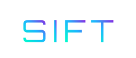
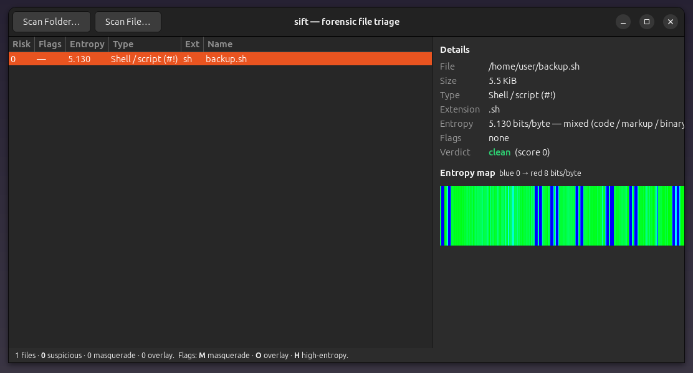

<div align="center">

<a href="https://github.com/effjy/sift/"></a>

**Forensic file triage — what is this file *really*, and is it hiding something?**

[](https://github.com/effjy/sift/)
[](LICENSE)
[](#)
[](#)
[](#)
[](#)
[](#)

</div>

---

`sift` is the triage step that comes **before** carving, recovery or secret-scanning:
point it at a file (or a whole tree) and it tells you, in one pass,

- **its byte-entropy structure** — whole-file *and* block-by-block Shannon entropy, drawn as a heatmap, so encrypted / compressed / packed regions light up;
- **what it actually is** — magic-byte file-type identification across ~35 formats (ELF, PE, Mach-O, PNG, JPEG, PDF, ZIP/Office, gzip/xz/zstd/7z/rar, SQLite, …);
- **whether it's lying** — *masquerade* detection when the real content contradicts the file extension (an ELF saved as `photo.jpg`);
- **whether something is hidden** — *overlay* detection of data appended past a format's logical end (PNG `IEND`, JPEG `EOI`, ZIP `EOCD`, PDF `%%EOF`, GIF trailer) — a classic exfiltration / stego trick.

Each file gets a suspicion **score** and a verdict — `clean` · `review` · `SUSPICIOUS` — so a recursive scan surfaces the handful of files worth a closer look.

It ships as two front-ends over one dependency-free C++17 engine (`triage.hpp`):

| Binary | What it is |
|:--|:--|
| **`sift`** | CLI — per-file report with a terminal entropy heatmap, plus a recursive `-r` table ranked by risk. **No dependencies.** |
| **`sift-gui`** | GTK4 dashboard — pick a folder, get a ranked table, click any row for its entropy map and verdict. |

---

## 🖼️ Screenshot

<div align="center">
  
  <br>
  <sub><i>sift-gui — a wide, single-pane triage dashboard: ranked file table on the left, entropy heatmap and verdict on the right.</i></sub>
</div>

---

## 📦 Prerequisites

The **CLI has no dependencies** beyond a C++17 compiler. The GUI additionally needs gtkmm-4.0.

**Debian / Ubuntu**
```bash
sudo apt install build-essential          # CLI only
sudo apt install libgtkmm-4.0-dev          # add this for the GUI
```

**Fedora**
```bash
sudo dnf install gcc-c++ make              # CLI only
sudo dnf install gtkmm4.0-devel            # add this for the GUI
```

**Arch**
```bash
sudo pacman -S base-devel                  # CLI only
sudo pacman -S gtkmm-4.0                    # add this for the GUI
```

---

## 🔧 Build

```bash
make            # builds ./sift and ./sift-gui
make cli        # builds only ./sift  (no GTK toolkit required)
```

## 📥 Install

```bash
sudo make install      # installs both binaries + icon + desktop entry to /usr
```

This drops `sift` and `sift-gui` into `/usr/bin`, registers the application
icon in the hicolor theme and installs `sift.desktop`, so **sift-gui** appears
in your application menu and shows its icon in the taskbar.

```bash
sudo make uninstall    # removes everything
```

Override the prefix the usual way: `sudo make install PREFIX=/usr/local`.

---

## 🚀 Usage — CLI

**Inspect a single file** (full report + entropy heatmap):
```bash
sift suspicious.bin
```
```
suspicious.bin
  size        195.3 KiB (200000 bytes)
  type        data / unknown  (no magic signature)
  extension   .bin
  entropy     7.999 bits/byte — near-random (encrypted or compressed)

  0                                                              0x30d40
  ██████████████████████████████████████████████████████████████████
  low  ▁▂▃▄▅▆▇█  high entropy (0 → 8 bits/byte)

  verdict     review  (score 2, flags H)
```

**Catch a masquerade** — an executable wearing a `.jpg` extension:
```bash
sift photo.jpg
```
```
  type        ELF binary
  extension   .jpg
  MASQUERADE  content is ELF binary but extension is .jpg
  verdict     SUSPICIOUS  (score 5, flags M)
```

**Catch an overlay** — data smuggled past a PNG's logical end:
```bash
sift cat.png
```
```
  type        PNG image
  OVERLAY     29 B appended past the PNG image logical end
  verdict     review  (score 2, flags O)
```

**Triage a whole tree** — recursive, ranked by risk (clean files hidden):
```bash
sift -r ~/Downloads
```
```
RISK FLAGS ENTROPY TYPE                       EXT     PATH
5    M       5.935 ELF binary                 jpg     ~/Downloads/photo.jpg
2    H       7.999 data / unknown             bin     ~/Downloads/blob.bin
2    O       4.451 PNG image                  png     ~/Downloads/cat.png

  214 files scanned · 3 flagged · 1 suspicious · 1 masquerade · 1 overlay
  flags: M=masquerade  O=overlay/appended  H=high-entropy   (use -a to list clean files)
```

### Options

| Flag | Effect |
|:--|:--|
| `-r`, `--recursive` | Walk directories and print a ranked triage table |
| `-a`, `--all` | In table mode, also list `clean` (score-0) files |
| `-C`, `--no-color` | Disable ANSI color (also auto-off when piped or under `NO_COLOR`) |
| `-h`, `--help` | Show help |

---

## 🖱️ Usage — GUI

```bash
sift-gui
```

Click **Scan Folder…** to triage a directory tree, or **Scan File…** for one
file. The left pane lists every file ranked by suspicion; select any row to see
its full details and a horizontal **entropy heatmap** on the right (blue = low,
red = near-random). The layout is intentionally wide and short to fit on small
laptop displays.

---

## 🧠 How it reads a file

| Signal | What it means | How sift finds it |
|:--|:--|:--|
| **Entropy** | High, flat entropy (≈8 bits/byte) means ciphertext, a packer, or compression; structured dips mark headers and padding. | Shannon entropy over the whole file and over each block of the heatmap. |
| **File type** | The true format, regardless of the name on disk. | A magic-byte signature table (offsets + multi-anchor patterns for RIFF/ISO-BMFF). |
| **Masquerade** | The extension contradicts the content — a hallmark of dropped malware. | Detected type's canonical extensions vs. the file's actual extension. |
| **Overlay** | Bytes appended past where the format logically ends — exfil, stego, or a polyglot. | Per-format logical-end parsing (PNG `IEND`, JPEG `EOI`, ZIP `EOCD`, PDF `%%EOF`, GIF trailer). |

Files larger than the per-file cap (512 MiB for a single CLI target, 16 MiB
while walking a tree, 64 MiB in the GUI) are analyzed by prefix and clearly
marked — entropy and type stay accurate; overlay detection is skipped.

---

## 📄 License

MIT © 2026 **Jean-Francois Lachance-Caumartin**. See [LICENSE](LICENSE).

Repository: <https://github.com/effjy/sift/>
